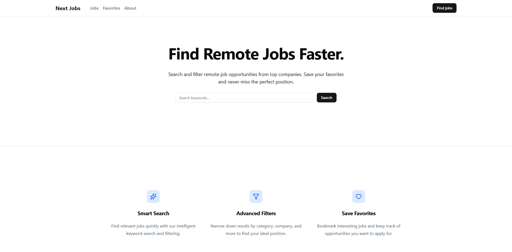
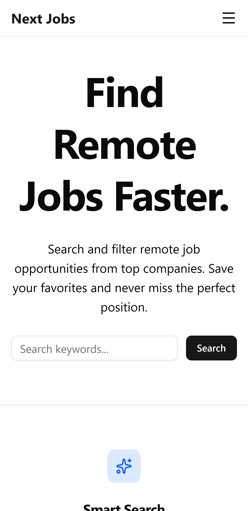

# Next Jobs

A modern remote job board application built with Next.js, designed to demonstrate modern frontend architecture, filtering, sorting, responsive UI, and clean component design.

The application allows users to browse remote job listings, filter and sort them, and save favorite jobs locally in the browser.

This project was built as part of a developer portfolio to showcase modern React and Next.js development practices.

## Live Demo

Deployed on [Vercel](https://next-jobs-cyan.vercel.app/).

<p align="center">
  
  
</p>

## Features

- Browse remote job listings
- Search jobs by keywords
- Filter by category and company
- Sort jobs by:
  - newest
  - oldest
  - title
- Save favorite jobs
- Favorites stored in localStorage
- Responsive UI (desktop + mobile)
- Mobile navigation drawer
- Clean card-based job layout
- Accessible UI components

## Tech Stack

### Framework
- Next.js (App Router)

### Language
- TypeScript

### UI
- React
- Tailwind CSS
- shadcn/ui
- Lucide Icons

### State / Data
- React Hooks
- Browser localStorage

### APIs
- Remotive Jobs API

### Tooling
- ESLint
- Prettier
- TypeScript

### Deployment
- Vercel

## Getting Started

### 1. Clone the repository
```bash
git clone https://github.com/ricardo-boock/next-jobs.git
```

### 2. Navigate into the project
```bash
cd next-jobs
```

### 3. Install dependencies
```bash
npm install
```
### 4. Start the development server
```bash
npm install
```

Open: 

```bash
http://localhost:3000
```

## Data Source

Job listings are provided by the **Remotive Jobs API**.

```bash
https://remotive.com/api/remote-jobs
```

All job listing data originates from this external API.

## Favorites System

Users can save jobs as favorites.

Favorites are stored locally in the browser using:

```bash
localStorage
```

Stored data includes only:

```bash
job ids
```

No favorites data is transmitted to any server.

## Deployment

The application is deployed using Vercel.

Typical deployment workflow:

```bash
GitHub → Vercel → Production
```

Every push can automatically trigger a new deployment.

## Legal Notice

This project includes:

- Impressum
- Privacy Policy

These pages exist to comply with German and EU legal requirements for publicly accessible websites.

## License

```bash
© 2026 Ricardo Boock
All rights reserved.
```

This repository is published for portfolio and demonstration purposes only.

You may not copy, modify, distribute, or reuse this code without explicit permission from the author.

## Author

Ricardo Boock

GitHub

```bash
https://github.com/ricardo-boock
```

## Portfolio

This project demonstrates experience with:
- Next.js App Router
- component architecture
- React hooks
- filtering and sorting patterns
- responsive UI design
- TypeScript
- modern frontend tooling